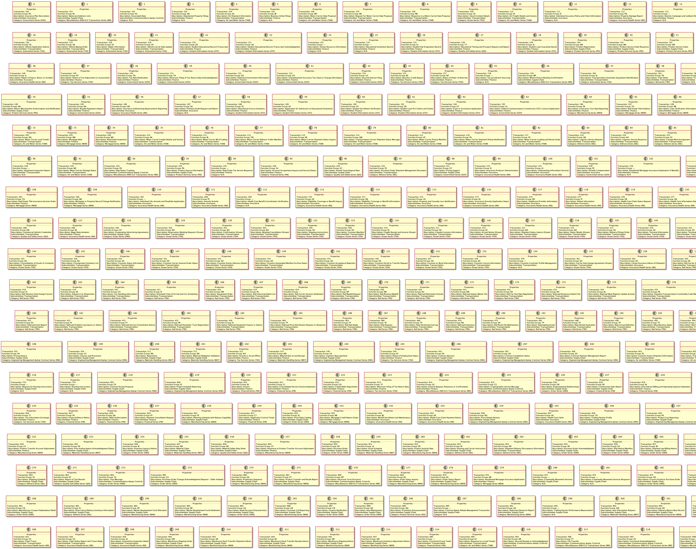

# EDI Diagrams & UML's

> Notice: X12 EDI sets are under `license` - you must have a commerical license to use this in production

## Overview

To generate digrams use `json-to-plantuml` 

The `bash.sh scripts` contain the proper command line arguments to generate these diagrams in their entire aspect ratio. 

### System Requirements 

> Note: you really do need at least 1gigabyte of free RAM, these images are big and can take up to a minute a piece to generate 

Java JDK 8 or 11 
1gig RAM
4gig free space

### Diagram Examples

\n
 
\n
 
\n
 
\n
 

